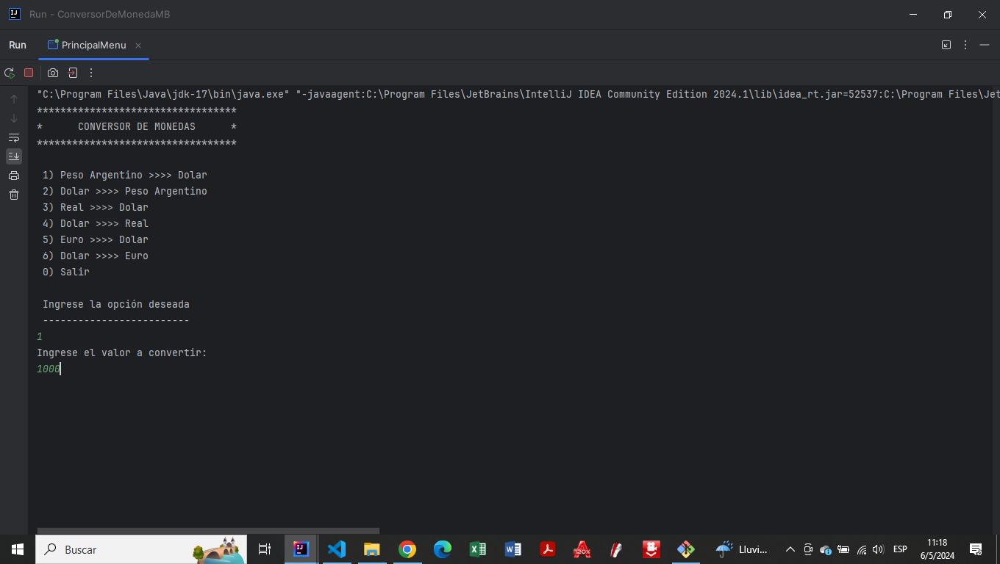
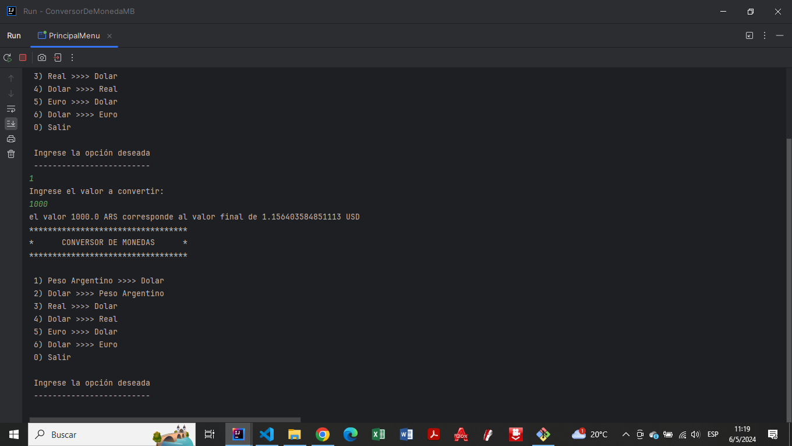
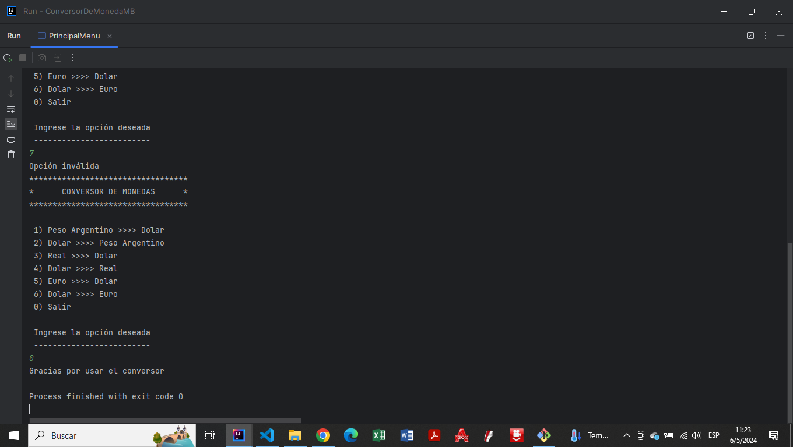

# Conversor de Monedas
Aplicacion que permite realizar la conversion entre diferentes monedas.

## Caracteristicas
- Esta aplicacion consume la API de ExchangeRate
- Usa la libreria Gson de google, que permite manipular la respuesta en formato Json generada por la API
- Uso de HttpClient, HttpRequest, HttpResponse, que permite realizar peticiones a la API

##  Ejecucion de la Aplicacion
- Clonar el repositorio
- Abrirlo en algun IDE que permita la ejecucion de archivos .java
- Ejecutar la aplicacion desde la clase Principal

- En la consola, aparecera el menu con las diferentes opciones

- Elija una opcion para iniciar el programa

- Se muestra el resultado de la conversion y nuevamente el menu para continuar

- Se avisa si la opcion ingresada es invalida y se muestra el menu nuevamente

- Finalmente al optar por salir del menu se muestra un mensaje de agradecimiento

